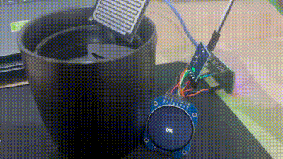

# Water-Level-sensor
ESP32 Water Level Sensor and TFT Display Project. I also use a webpage to display sensor readings using AJAX. However The TFT display has stopped working when I implemented this functionality(webserver).

### Components Used
ESP32 Development Board: Used as the main microcontroller.
TFT Display (ST7735): Display module for visual output.
Water Level Sensor: Analog sensor to measure water level.
LED: Indicator controlled via the web server.

### Other Components:

LED_PIN: GPIO pin for controlling an LED.
rainAnalog: Analog pin connected to the water level sensor.
rainDigital: Digital pin for supplementary control (if used).
Libraries Used
WiFi.h: ESP32 WiFi library for connecting to a network.
WebServer.h: Library to create a web server on the ESP32.
TFT_eSPI.h: Graphics library for the ST7735 TFT display.
